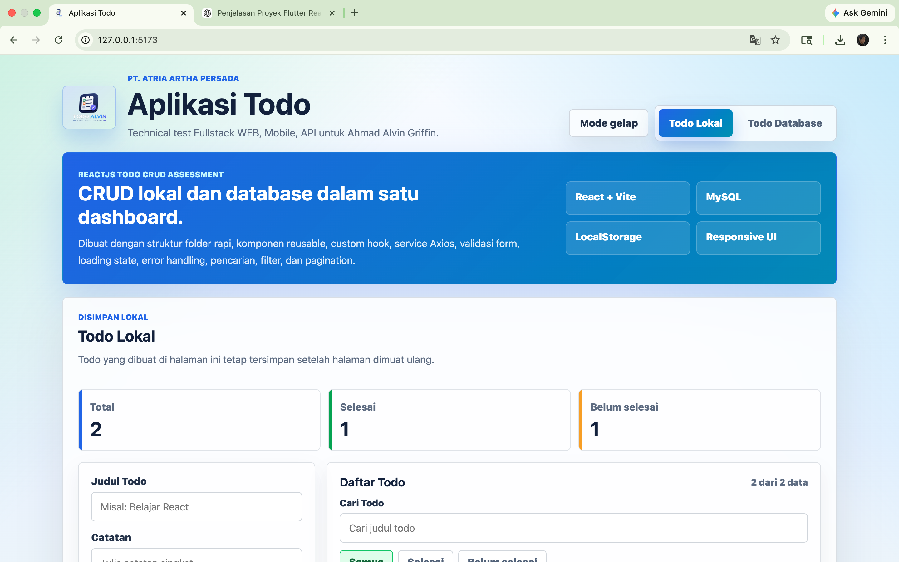
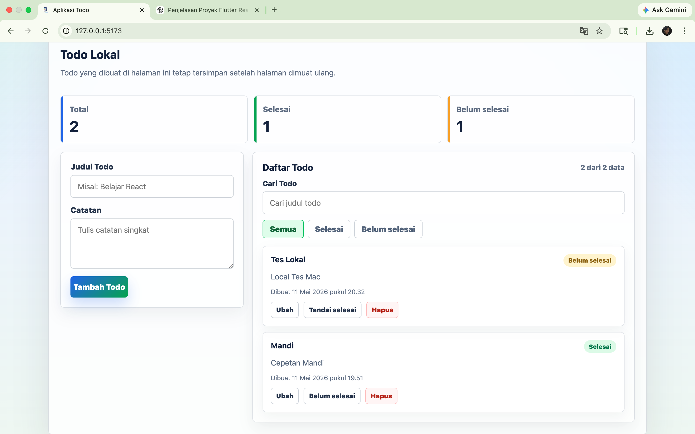
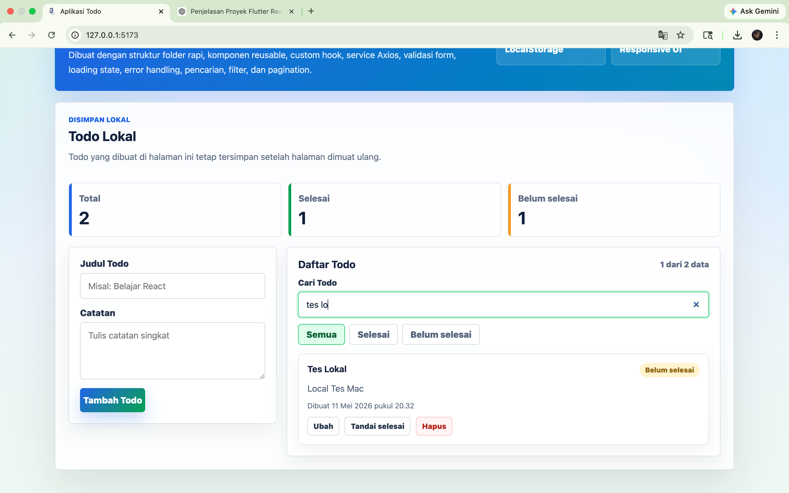
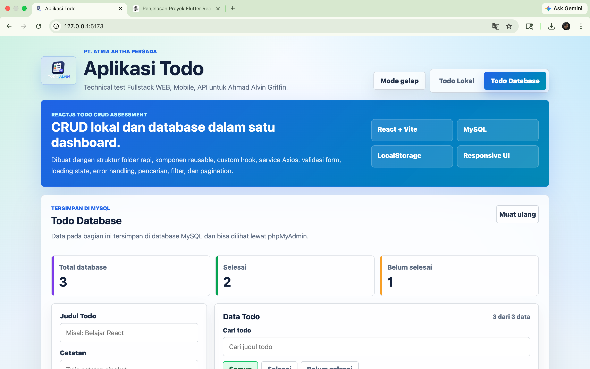
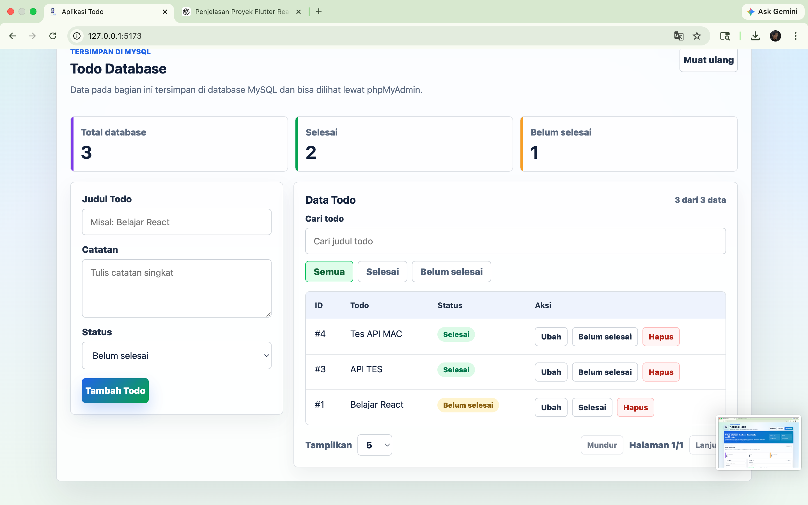
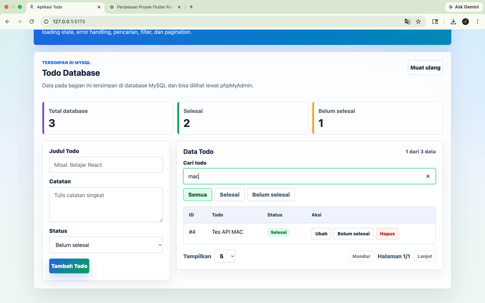
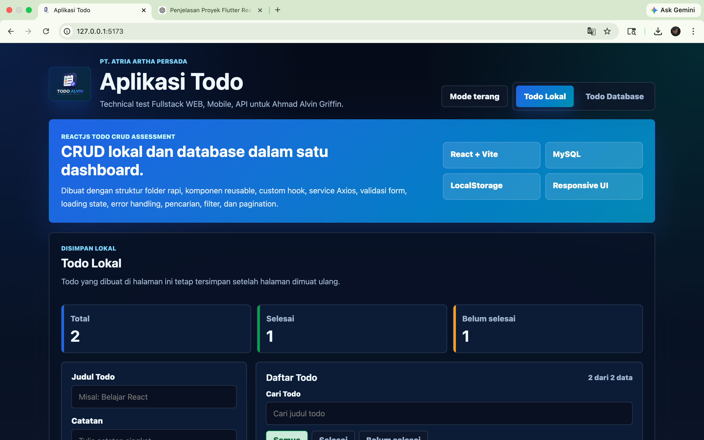
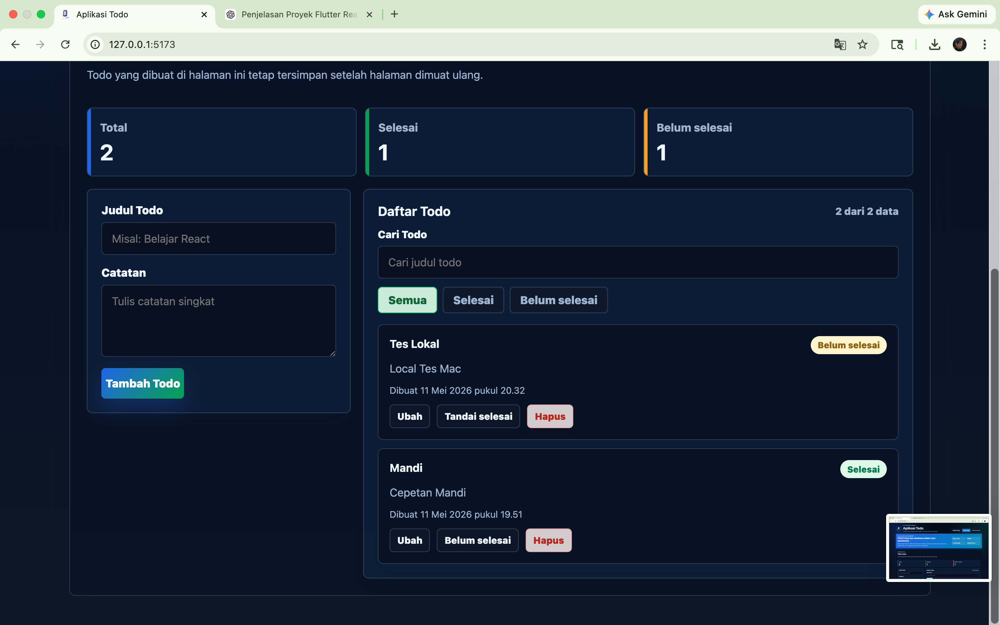
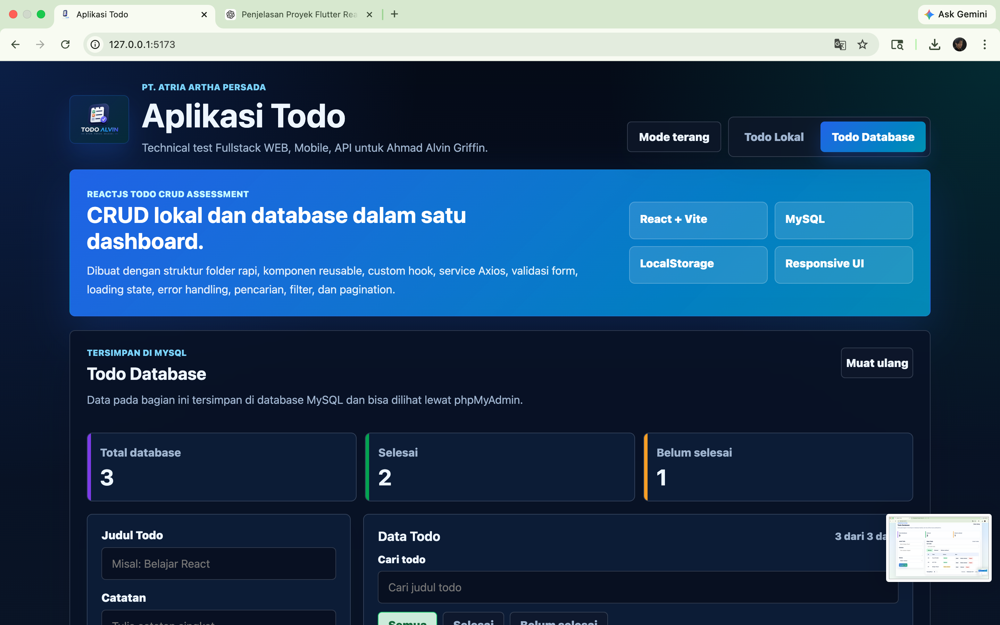
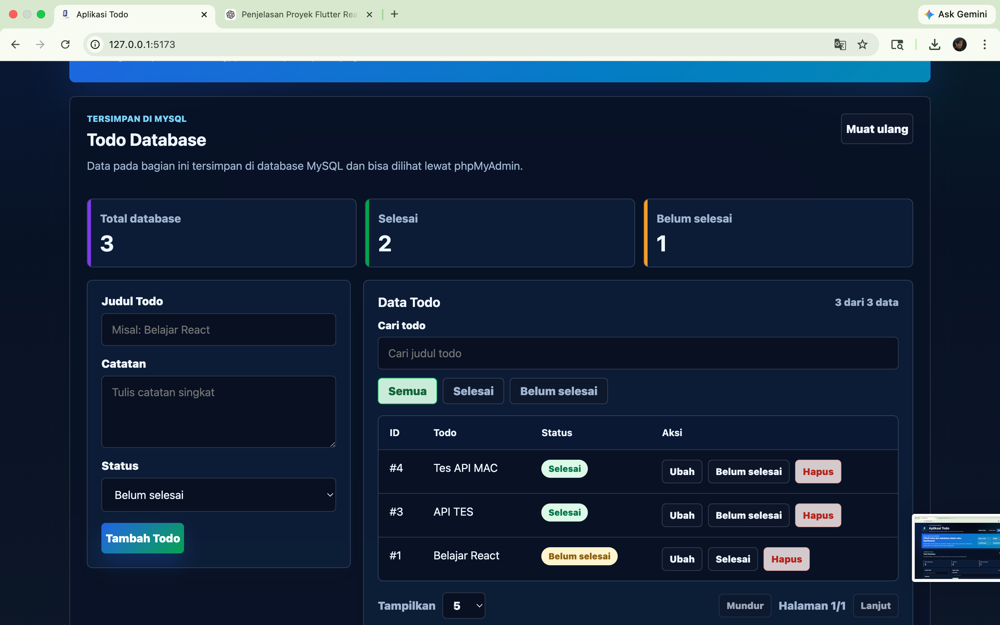

# Aplikasi Todo React - PT. ATRIA ARTHA PERSADA

Aplikasi ini dibuat untuk technical test Fullstack WEB, Mobile, API di PT. ATRIA ARTHA PERSADA. Fitur utama dibagi menjadi dua bagian: Todo Lokal dan Todo Database.

## Fitur

- Tambah, lihat, edit, ubah status, dan hapus todo lokal.
- Todo lokal tersimpan di LocalStorage.
- Tambah, lihat, edit, ubah status, dan hapus todo dari database MySQL.
- Pencarian dan filter status.
- Pagination untuk data dari database.
- Loading state dan pesan error sederhana.
- Tampilan responsif untuk desktop dan mobile.
- Mode gelap dan terang.
- Pencarian memakai debounce.
- Dashboard ringkasan data.
- UI dibuat lebih modern, berwarna, dan tetap rapi.

## Teknologi

- ReactJS
- Vite
- JavaScript
- Axios
- Node.js
- Express
- MySQL
- LocalStorage
- CSS biasa

## Struktur Folder

```text
src/
  components/
  hooks/
  pages/
  services/
  utils/
server/
  database.js
  index.js
database/
  schema.sql
```

## Database

Database yang dipakai:

```text
todo_harian
```

Tabel yang dipakai:

```text
daftar_todo
```

Kolom tabel:

```text
id
judul
catatan
status
tanggal_dibuat
tanggal_diubah
```

Status todo memakai nilai:

```text
belum_selesai
selesai
```

Schema database tersedia di:

```text
database/schema.sql
```

## Cara Menyiapkan Database

Pastikan MySQL dari XAMPP sudah aktif, lalu jalankan:

```bash
/Applications/XAMPP/xamppfiles/bin/mysql -h127.0.0.1 -P3306 -uroot < database/schema.sql
```

Database juga bisa dicek lewat phpMyAdmin.

## Cara Install

```bash
npm install
```

## Cara Menjalankan Backend

```bash
npm run api
```

Backend berjalan di:

```text
http://127.0.0.1:3001
```

## Cara Menjalankan Frontend

Buka terminal baru, lalu jalankan:

```bash
npm run dev
```

Frontend berjalan di:

```text
http://127.0.0.1:5173
```

## Cara Build

```bash
npm run build
```

## Catatan Arsitektur

- `components` berisi komponen UI yang dipakai ulang.
- `hooks` berisi logic todo lokal, todo database, dan debounce pencarian.
- `services` berisi request Axios ke backend.
- `server` berisi backend Express untuk koneksi ke MySQL.
- `database` berisi schema MySQL.

Data todo lokal tetap disimpan di browser. Data todo database tersimpan di MySQL, sehingga isi tabel dapat dilihat dan dikelola melalui phpMyAdmin.

## Screenshot

Beberapa tampilan aplikasi yang sudah dibuat:

### Todo Lokal







### Todo Database







### Mode Gelap








